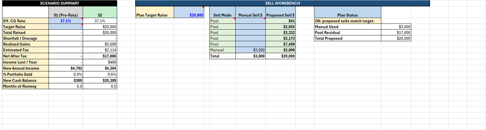
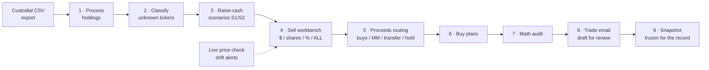
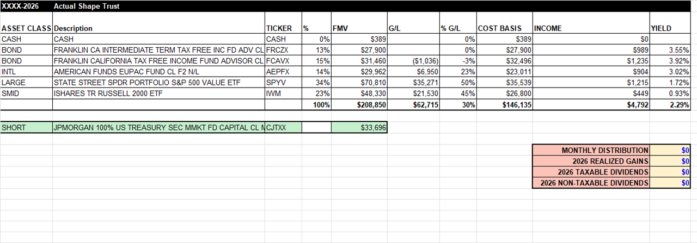
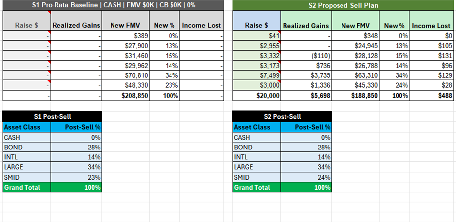

# CDS Trade Assistant

Excel VBA macros for turning a custodial holdings CSV into a reviewed CDS trade-planning workbook: holdings normalization, unknown ticker review, raise-cash scenarios, a sell workbench that speaks the client's language ($ / shares / % of position / % of account / sell-all), proceeds routing, buy plans, price staleness checks, math audit, draft trade email generation, and values-frozen snapshots for the record.

I built this as a practicing financial advisor (Series 7/63/65) for a workflow where the advisor stays in Excel, reviews every assumption, and keeps final trade judgment manual.

   

**Scenario summary and sell workbench** — a $20,000 raise planned against a synthetic portfolio: pooled sells auto-allocated, one manual override, one exclusion, tax impact and income lost computed per scenario.



*Every screenshot below was generated by actually running these macros — Excel driven headlessly over the synthetic fixtures in `sample-data/` (see `Testing`). No mockups.*

## The pipeline



**1 — Processed holdings.** The raw export becomes a normalized sheet: asset-class grouping, gain/loss math, yield, an allocation pivot, and a short-position callout.



**2 — Scenarios.** S1 pro-rata baseline vs. S2 proposed sell plan, each with realized gains, income lost, and a post-sell allocation pivot.



The full workbench in one strip: [docs/media/pipeline-full.png](docs/media/pipeline-full.png).

## What is included

- `vba/CDS_Holdings_Processor.bas` - imports and normalizes raw holdings exports; multi-account exports prompt for which account to process instead of silently blending.
- `vba/CDS_Unknowns.bas` and `vba/CDS_Settings.bas` - review and maintain ticker classification rules.
- `vba/CDS_Raise_Cash_Scenarios.bas` - creates S1/S2/S3 raise-cash scenarios.
- `vba/CDS_Sell_Workbench.bas` - worksheet-native sell planning: each manual sell can be expressed as dollars, share count, % of position, % of account, or ALL; shortfall and cash-available advisories; illiquid CUSIP positions default out of the pool.
- `vba/CDS_Routing.bas` - PROCEEDS ROUTING table: declare how much of the raise funds buys, stays in money market, transfers out, or holds as cash, with reconciliation status.
- `vba/CDS_Buy_Plans.bas` - builds scenario-funded and cash-only buy plans; the plan scenario funds from its routed allocation.
- `vba/CDS_PriceGuard.bas` - checks live quotes (Excel Stocks linked data types) against the export's implied prices and flags drifted tickers; never modifies holdings values.
- `vba/CDS_Trade_Email.bas` - drafts a reviewed trade email that narrates the instruction as given (shares/percent/sell-all language, routing destinations); refuses while routing does not reconcile; it does not send automatically.
- `vba/CDS_Snapshots.bas` - freezes a plan to a values-only, protected SNAP sheet with a queryable CDS Snapshots index; exports snapshots to standalone .xlsx.
- `vba/CDS_Session.bas` - rolls a workbook from one meeting to the next: freezes the current live report, removes it, imports a fresh Client Center CSV as the new live report, and processes it.
- `vba/CDS_MathAudit.bas` - audits workbook calculations, amount-spec conversions, routing reconciliation, and flags wash-sale risk (loss sale reappearing in a buy plan).
- `vba/CDS_MacroLauncher.bas`, `vba/CDS_AssistantLauncher.bas`, `vba/CDS_RibbonCallbacks.bas`, `vba/CDS_ButtonHandler.cls`, `vba/frmCDSTradeAssistant.frm`, and `ribbon/customUI14.xml` - modeless form and Ribbon entrypoints.
- `sample-data/*.csv` - synthetic holdings fixtures for testing parser and workbook behavior.
- `tests/` - headless Excel regression suite (see Testing).

## Per-client sessions

Each workbook is meant to be one client's history file: a `CDS Snapshots` index sheet, a growing stack of frozen `SNAP` sheets, and exactly one live report at a time. `New Session` (`StartNewSession` in `vba/CDS_Session.bas`) freezes whatever report is currently live to a dated snapshot, removes it once the snapshot is verified to exist, then imports a fresh Client Center CSV as the new live report and processes it - the normal way to roll a workbook from one meeting to the next without losing history. On a fresh, empty workbook it just imports and processes, which is how a client file gets started. Filename discipline (which client the workbook belongs to) is still the advisor's job, not the macro's.

## Main entrypoints

- `ProcessCDSHoldings`
- `ProcessCDSHoldings_Lite`
- `AddRaiseCashScenarios`
- `BuildSellWorkbench`
- `SpawnScenario`
- `RemoveScenario`
- `BuildRoutingBlock`
- `AddBuyPlans`
- `AddCashOnlyBuyPlan`
- `RefreshLivePrices`
- `GenerateTradeEmail`
- `SaveCDSSnapshot` / `ExportSnapshotToFile`
- `StartNewSession`
- `AuditActiveCDSMath`
- `SaveUnknownsAndRefresh`
- `OpenSettings` / `CloseSettings`
- `OpenCDSTradeAssistant`
- `EnableContextHandler`

## Safety model

- Runs locally inside Excel; no backend and no external API calls. The optional live-price check uses Excel's built-in Stocks linked data types (Microsoft's own quote feed, requires a Microsoft 365 license that includes data types) and only ever reads quotes - imported holdings values are never modified.
- Uses synthetic sample data in this repository; no real client holdings are included.
- The email workflow prepares a draft/review surface only; it does not auto-send, and it refuses to generate while the proceeds routing does not reconcile.
- The wash-sale flag covers this workbook only: a loss sale whose ticker reappears in a buy plan is flagged, but purchases in outside accounts (a 401(k), a spouse's account) are invisible to any tool working from a single holdings export. That boundary is by design and worth remembering.
- Snapshots are values-only frozen copies - nothing on a SNAP sheet recalculates, and the pipeline's state detection ignores them, so a months-old snapshot can never be mistaken for a live plan.
- The workbook automation is designed around explicit advisor review before action.

## Using the source

Import the files in `vba/` into a trusted Excel macro workbook or add-in. The `ThisWorkbook.cls` code must be installed into the workbook/add-in document module if you want the selection-change context behavior. Import `frmCDSTradeAssistant.frm` together with its sibling `frmCDSTradeAssistant.frx`.

The Ribbon XML in `ribbon/customUI14.xml` references callback wrappers in `CDS_RibbonCallbacks.bas`.

## Testing

The repo ships a headless regression suite that drives a real Excel instance over the synthetic fixtures - no mocks, the actual macros run end to end and the suite asserts on the CDS_MATH_AUDIT results sheet and feature behavior.

Requirements: Windows, Microsoft 365 Excel, Python 3 with `pywin32`, and Trust Center > Macro Settings > "Trust access to the VBA project object model" enabled.

```
python tests/run_pipeline.py                 # full pipeline, 169 audit checks
python tests/run_pipeline.py --fixture sample-data/cds_holdings_raw_two_accounts.csv
python tests/verify_amount_spec.py           # $/shares/%/ALL conversions
python tests/verify_routing.py               # routing math + funding integration
python tests/verify_guards.py                # shortfall, cash notice, CUSIP defaults, account picker
python tests/verify_wash_flag.py             # wash-sale flagging
python tests/verify_email.py                 # instruction-faithful email + refusal path
python tests/verify_snapshots.py             # frozen snapshots + index
python tests/verify_new_session.py           # per-client session rollover (freeze, remove, re-import)
python tests/verify_price_guard.py           # drift alerts (tolerates offline)
```

`tests/TestShims.bas` shadows `MsgBox`/`InputBox` during test runs so nothing blocks; it is never imported into a production workbook.

A manual QA pass over the same fixtures:

1. Open one of the raw holdings CSV fixtures in Excel.
2. Run `ProcessCDSHoldings`.
3. If unknown tickers are shown, classify them and run `SaveUnknownsAndRefresh`.
4. Run `AddRaiseCashScenarios` and adjust scenario assumptions.
5. Run `BuildSellWorkbench`, set sell modes and amount specs, then `BuildRoutingBlock` and declare destinations.
6. Run `AddBuyPlans` and `AuditActiveCDSMath`.
7. Run `GenerateTradeEmail` only after validating the workbook output, and save a snapshot when prompted.

## Privacy

This repository is source code plus synthetic fixtures only. Generated workbooks, local Excel personal workbooks, temporary browser/session files, logs, zips, and build outputs are intentionally ignored.

## License

MIT - see [LICENSE](LICENSE).