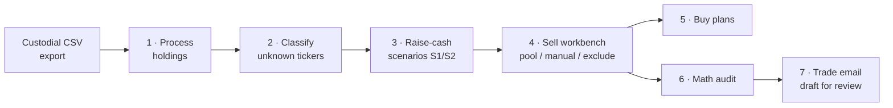

# CDS Trade Assistant

Excel VBA macros for turning a custodial holdings CSV into a reviewed CDS trade-planning workbook: holdings normalization, unknown ticker review, raise-cash scenarios, sell workbench, buy plans, math audit, and draft trade email generation.

I built this as a practicing financial advisor (Series 7/63/65) for a workflow where the advisor stays in Excel, reviews every assumption, and keeps final trade judgment manual.

  

**Scenario summary and sell workbench** — a $20,000 raise planned against a synthetic portfolio: pooled sells auto-allocated, one manual override, one exclusion, tax impact and income lost computed per scenario.

*Every screenshot below was generated by actually running these macros — Excel driven headlessly over the synthetic fixtures in `sample-data/` (see `Testing`). No mockups.*

## The pipeline

**1 — Processed holdings.** The raw export becomes a normalized sheet: asset-class grouping, gain/loss math, yield, an allocation pivot, and a short-position callout.

**2 — Scenarios.** S1 pro-rata baseline vs. S2 proposed sell plan, each with realized gains, income lost, and a post-sell allocation pivot.

The full workbench in one strip: [docs/media/pipeline-full.png](docs/media/pipeline-full.png).

## What is included

- `vba/CDS_Holdings_Processor.bas` - imports and normalizes raw holdings exports.
- `vba/CDS_Unknowns.bas` and `vba/CDS_Settings.bas` - review and maintain ticker classification rules.
- `vba/CDS_Raise_Cash_Scenarios.bas` - creates S1/S2/S3 raise-cash scenarios.
- `vba/CDS_Sell_Workbench.bas` - adds a worksheet-native sell planning workbench.
- `vba/CDS_Buy_Plans.bas` - builds scenario-funded and cash-only buy plans.
- `vba/CDS_Trade_Email.bas` - drafts a reviewed trade email; it does not send automatically.
- `vba/CDS_MathAudit.bas` - audits workbook calculations after scenario and buy-plan workflows.
- `vba/CDS_MacroLauncher.bas`, `vba/CDS_AssistantLauncher.bas`, `vba/CDS_RibbonCallbacks.bas`, `vba/CDS_ButtonHandler.cls`, `vba/frmCDSTradeAssistant.frm`, and `ribbon/customUI14.xml` - modeless form and Ribbon entrypoints.
- `sample-data/*.csv` - synthetic holdings fixtures for testing parser and workbook behavior.

## Main entrypoints

- `ProcessCDSHoldings`
- `ProcessCDSHoldings_Lite`
- `AddRaiseCashScenarios`
- `BuildSellWorkbench`
- `SpawnScenario`
- `RemoveScenario`
- `AddBuyPlans`
- `AddCashOnlyBuyPlan`
- `GenerateTradeEmail`
- `AuditActiveCDSMath`
- `SaveUnknownsAndRefresh`
- `OpenSettings` / `CloseSettings`
- `OpenCDSTradeAssistant`
- `EnableContextHandler`

## Safety model

- Runs locally inside Excel; no backend and no external API calls.
- Uses synthetic sample data in this repository; no real client holdings are included.
- The email workflow prepares a draft/review surface only; it does not auto-send.
- The workbook automation is designed around explicit advisor review before action.

## Using the source

Import the files in `vba/` into a trusted Excel macro workbook or add-in. The `ThisWorkbook.cls` code must be installed into the workbook/add-in document module if you want the selection-change context behavior. Import `frmCDSTradeAssistant.frm` together with its sibling `frmCDSTradeAssistant.frx`.

The Ribbon XML in `ribbon/customUI14.xml` references callback wrappers in `CDS_RibbonCallbacks.bas`.

## Testing

Use the CSV fixtures in `sample-data/` to exercise the workflow without client data. A normal manual QA pass is:

1. Open one of the raw holdings CSV fixtures in Excel.
2. Run `ProcessCDSHoldings`.
3. If unknown tickers are shown, classify them and run `SaveUnknownsAndRefresh`.
4. Run `AddRaiseCashScenarios` and adjust scenario assumptions.
5. Run `BuildSellWorkbench`, `AddBuyPlans`, and `AuditActiveCDSMath`.
6. Run `GenerateTradeEmail` only after validating the workbook output.

## Privacy

This repository is source code plus synthetic fixtures only. Generated workbooks, local Excel personal workbooks, temporary browser/session files, logs, zips, and build outputs are intentionally ignored.

## License

MIT - see [LICENSE](LICENSE).