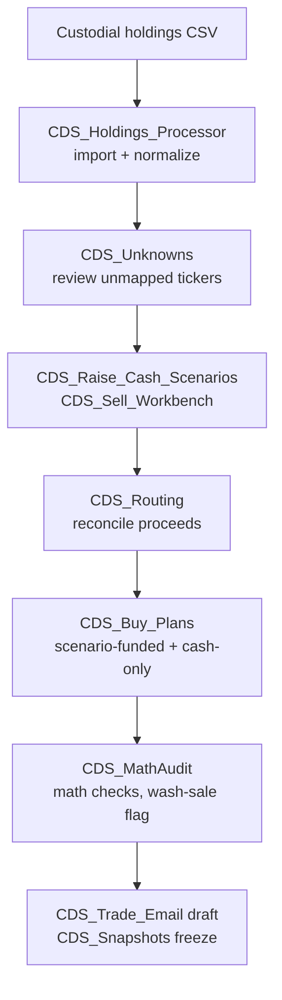
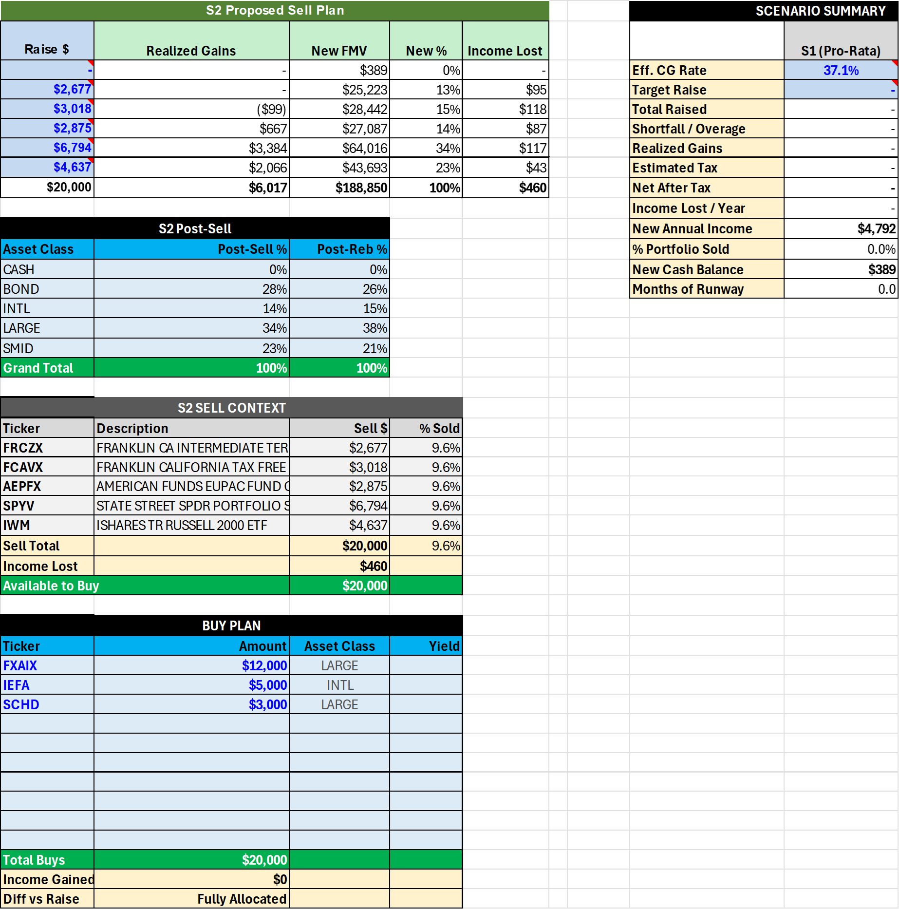
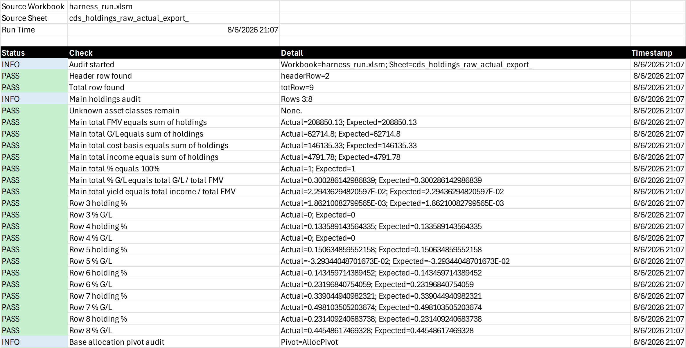

# Trade Macro Pipeline

[](vba/)
[](tests/)
[](LICENSE)

An Excel/VBA workspace for turning a synthetic custodial holdings export into a reviewed trade-planning workbook. It covers holdings cleanup, raise-cash scenarios, sell instructions, proceeds routing, buy plans, workbook math checks, email drafting, and frozen snapshots.

I built it around a recurring wealth-management workflow in Excel, with every assumption visible. The tool prepares the analysis but leaves trade execution to the advisor.

## The flow

1. Import and normalize a holdings CSV.
2. Review unknown tickers and unusual positions.
3. Compare raise-cash scenarios.
4. Express proposed sells in dollars, shares, percent of position, percent of account, or sell-all.
5. Reconcile proceeds across buys, money market, transfers, and held cash.
6. Draft an email for review and freeze a values-only snapshot.

The workbook does not place trades or send email. It does not retrieve market data; calculations use values from the imported CSV or values entered in Excel.



## What it looks like

The screenshots below come from a real Excel run of `tests/run_pipeline.py` using the synthetic fixture `sample-data/cds_holdings_raw_actual_export_shape.csv`.



A $20,000 raise-cash scenario: pro-rata sell amounts per position, resulting allocation drift, income lost, and a buy plan reinvesting the proceeds.



The math audit re-derives every total, percentage and yield on the sheet and logs each check with its actual and expected value.

## Repository contents

- `vba/CDS_Holdings_Processor.bas` imports and normalizes holdings.
- `vba/CDS_Raise_Cash_Scenarios.bas` and `vba/CDS_Sell_Workbench.bas` build sell scenarios.
- `vba/CDS_Routing.bas` reconciles the destination of proposed proceeds.
- `vba/CDS_Buy_Plans.bas` builds scenario-funded and cash-only buy plans.
- `vba/CDS_MathAudit.bas` checks workbook calculations and flags same-workbook wash-sale risk.
- `vba/CDS_Trade_Email.bas` prepares a draft; it does not send.
- `vba/CDS_Snapshots.bas` creates protected, values-only snapshots.
- `vba/CDS_Session.bas` rolls a workbook to a new imported session after preserving the current one.
- `sample-data/` contains synthetic fixtures.
- `tests/` drives a real Excel instance and also checks source boundaries.

## Run the checks

Requirements for the workbook suite: Windows, Microsoft Excel, Python 3, `pywin32`, and Trust Center access to the VBA project object model.

```text
python tests/run_pipeline.py
python tests/verify_amount_spec.py
python tests/verify_routing.py
python tests/verify_guards.py
python tests/verify_wash_flag.py
python tests/verify_email.py
python tests/verify_snapshots.py
python tests/verify_new_session.py
python tests/verify_no_live_market_data.py
python tests/verify_public_portfolio.py
```

GitHub Actions runs the public-boundary checks. The Excel/pywin32 integration suite requires local Windows and Excel and is not run in GitHub Actions.

The test harness alone uses `tests/TestShims.bas` to prevent message boxes from blocking automated runs.

## Boundaries

- The repository contains source code and synthetic fixtures, not real holdings.
- The repository has no external market-data integration.
- The email step creates a draft for review and never sends it.
- Wash-sale checks can see only the workbook’s own sell and buy plans.
- Values-only snapshots do not recalculate or become the active planning sheet.
- The operator remains responsible for reviewing assumptions and any action taken outside the workbook.

See [DISCLAIMER.md](DISCLAIMER.md) and [SECURITY.md](SECURITY.md).

## License

MIT. See [LICENSE](LICENSE).
